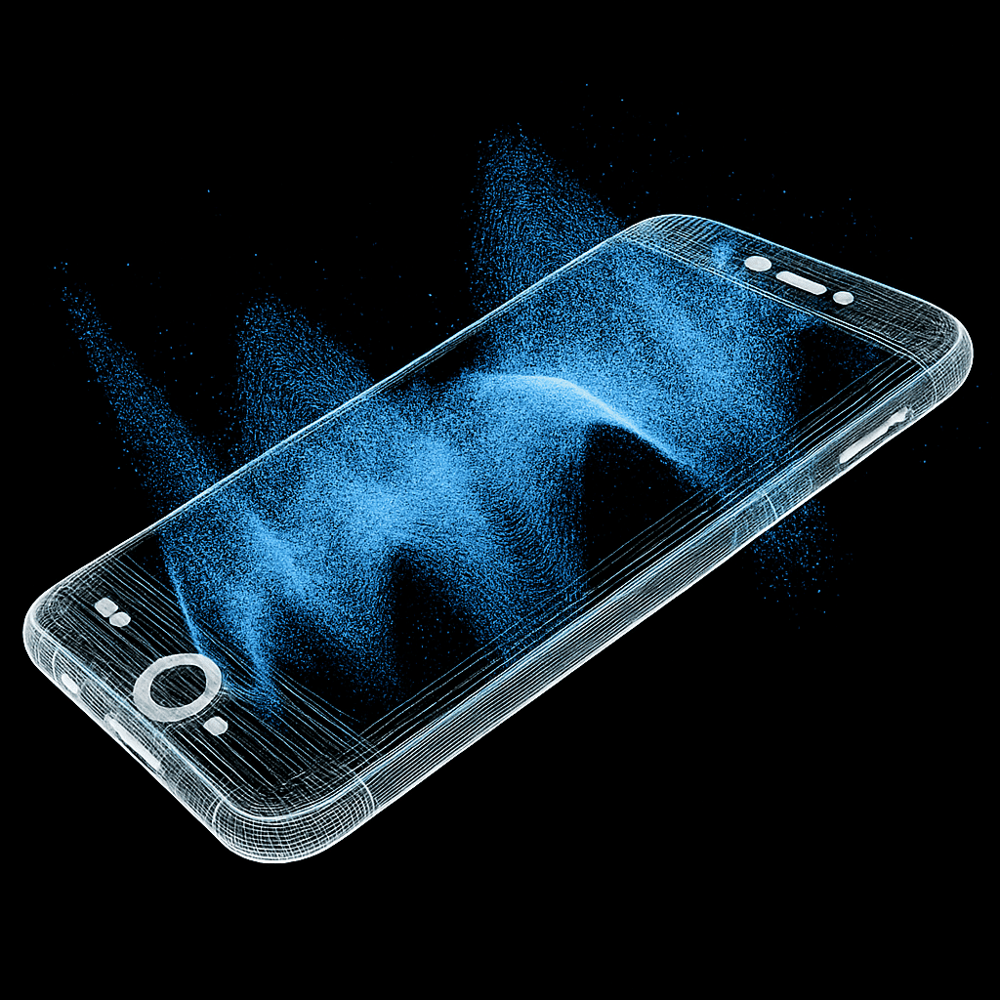

  

    

      
    

    

      <h1 class="text-2xl font-bold mb-4">Embed voice in your application</h1>
      

        Outspeed helps you add a voice interface to your mobile and web apps. Build an empathetic
        therapist, a chatty companion or a professional AI interviewer: possibilities are endless.
      

    

  

  ## Overview

  <CardGroup cols={2}>
    <Card title="Quickstart" icon="rocket" href="/get-started/quickstart">
      Get started with Outspeed in minutes.
    </Card>
    <Card title="Templates" icon="book" href="/get-started/templates">
      Explore pre-built templates to jumpstart your voice AI projects.
    </Card>
  </CardGroup>

  ## Examples

  <CardGroup cols={2}>
    <Card title="HR" icon="user-tie" href="/get-started/examples">
      Voice agent for HR interviews and onboarding.
    </Card>
    <Card title="Therapist" icon="user-nurse" href="/get-started/examples">
      Empathetic voice agent for therapy and support.
    </Card>
    <Card title="Companion" icon="user-friends" href="/get-started/examples">
      Friendly AI companion for conversation.
    </Card>
    <Card title="Interviewer" icon="user-secret" href="/get-started/examples">
      Simulated interviewer for practice and training.
    </Card>
  </CardGroup>

  {/* <h2>Templates</h2>

  <CardGroup cols={4}>
    <Card title="Next JS" icon="code" href="https://github.com/outspeed-ai/outspeed-nextjs-template">
    </Card>
    <Card title="React JS" icon="react" href="/react/setup">
    </Card>
    <Card title="React TS" icon="react" href="/react/setup">
    </Card>
    <Card title="Vite" icon="bolt" href="https://github.com/outspeed-ai/outspeed-vite-template">
    </Card>
    <Card title="Cloudflare" icon="cloud" href="https://github.com/outspeed-ai/outspeed-cloudflare-template">
    </Card>
    <Card title="Create React App" icon="react" href="https://github.com/outspeed-ai/outspeed-cra-template">
    </Card>
    <Card title="Flutter" icon="mobile" href="https://github.com/outspeed-ai/outspeed-flutter-template">
    </Card>
    <Card title="Swift" icon="apple" href="/iOS/outspeed-swift-getting-started">
    </Card>
  </CardGroup> */}

  <h2>Capabilities</h2>

  <CardGroup cols={3}>
    <Card title="Background Noise Removal" icon="volume-xmark">
      Remove unwanted background noise from audio.
    </Card>
    <Card title="Speaker Recognition" icon="user-check">
      Identify and distinguish between speakers.
    </Card>
    <Card title="Emotions" icon="face-smile">
      Detect and express emotions in voice.
    </Card>
    <Card title="Disfluencies" icon="wave-square">
      Handle and analyze speech disfluencies.
    </Card>
  </CardGroup>

